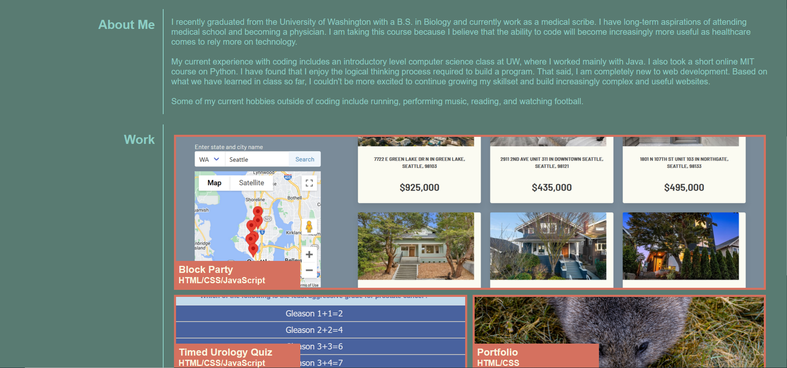

# Portfolio Page

## Description

This a website the displays information about me, links to my coding projects, and my contact information. The website has a responsive layout that adapts to the user's viewport whether they are using a smaller window or device.

## Installation

N/A

## Usage

Click on the links in the navigation bar to skip to a specific section in the website. Click on the captions inside each of my works for a link to the website they correspond to.

## Link to deployed Application
https://etfruitninja.github.io/my-first-portfolio/

## Screenshot

## Credits

The creation of this website was guided by the UW Coding Bootcamp.